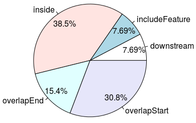
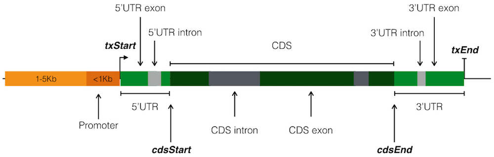
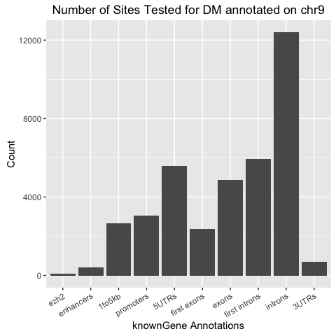
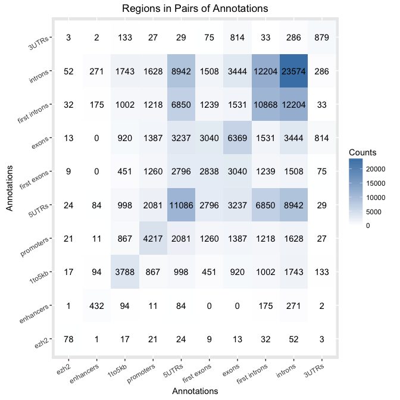
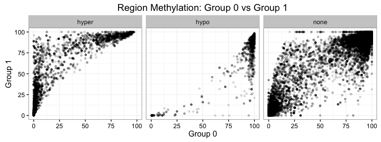
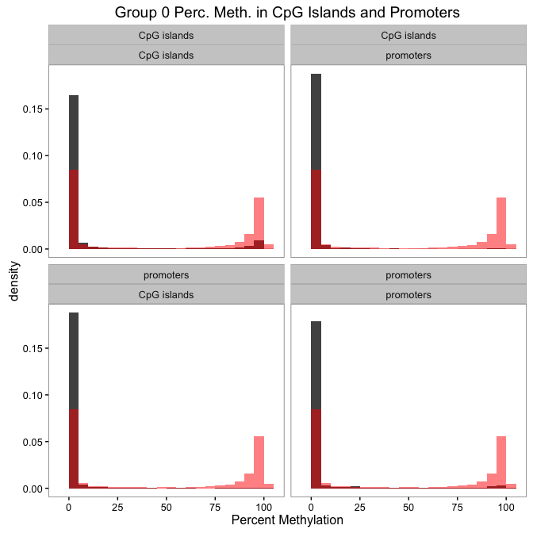
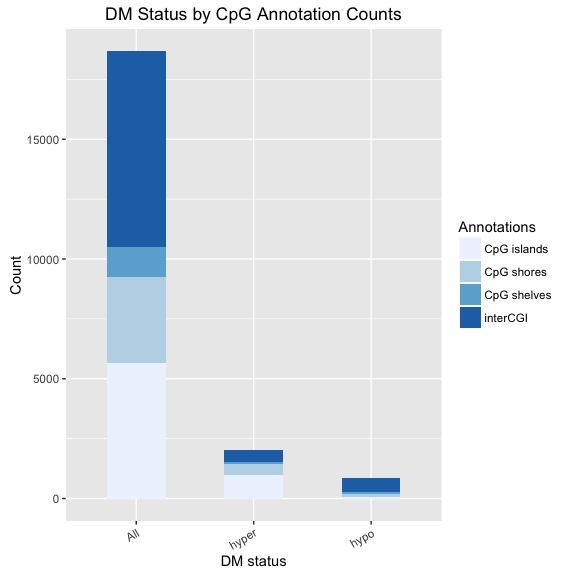
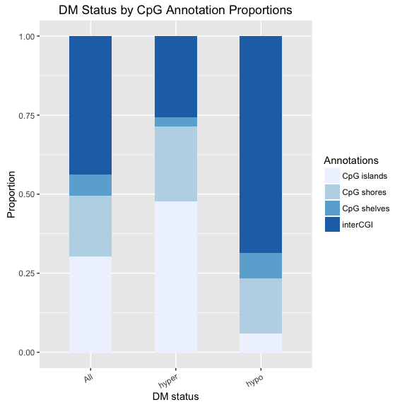
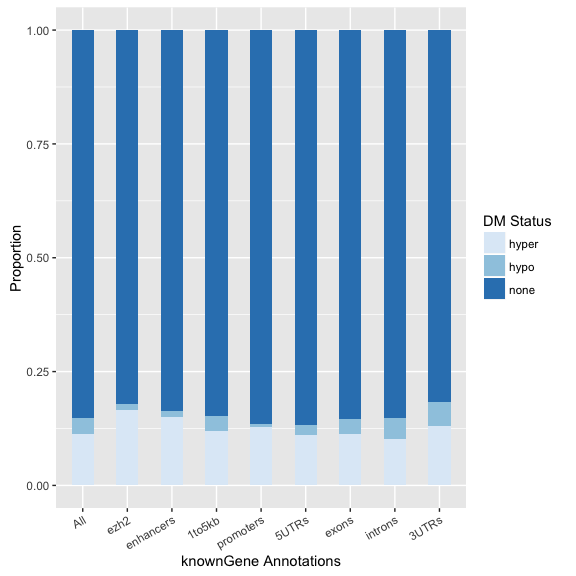

## Motivation

- Many high-throughput genomic experiments result in genomic regions.
    - ChIP-seq gives regions representing transcription factor (TF) binding.
    - Genome-wide association studies (GWAS) give single nucleotide polymorphisms (SNPs) associated with phenotypes.
    - BS-seq, RRBS, TAB-seq, oxBS-seq, etc. give percent methylation of CpGs.
    - MeDIP-seq and hMeDIP-seq give qualitative regions of methylation.

- **What genomic features do these sites or regions intersect?**
    - Does that TF primarily bind at promoters?
    - Is that SNP in an exon?
    - Is methylation lower in CpG dense regions?
    - Is there more differential methylation in exons or introns?

## Existing Tools : `ChIPpeakAnno`

- `ChIPpeakAnno` is a widely cited R package that was designed to annotate ChIP-seq peaks to genomic features.
    - When annotating to multiple features, a forced prioritization results in one-to-one region to annotation mapping.
    - Visualization of annotation to features is limited in utility.
    - Rather slow (more later) and confusing to use.

<div class="centered">

</div>

## Other Existing Tools

- `AnnotateGenomicRegions` is a web-based annotator.
    - It provides only tabular output.
    - Web-based means it doesn't play well in pipelines and reproducibility is harder.
- `bedtools` is a general tool to intersect BED files.
    - It is super fast and flexible.
    - It solves a general problem, so no visualization.

## `annotatr`

- A fast and flexible R package that gives genomic context to genomic regions.
    - Allows for *one-to-many* region-to-annotation mappings.
        - No longer artificially selecting an annotation according to a prioritization.
    - Summarize and visualize annotations using numerical or categorical data associated with regions.
- Implementation in modules:
    - Annotation database
    - Read regions
    - Annotate regions
    - Summarize and visualize annotations

## Annotation database

- Custom annotations supported for any genome.
- Built in annotations for hg19, hg38, mm9, and mm10.
    - CpG islands (CGI), shores, shelves, and open sea (interCGI).
    - KnownGene model (pictured below).
    - Enhancers from FANTOM5 consortium for hg19.



## Read regions with `read_bed()`

```{bash, eval=FALSE}
# Example BED6+ regions with extra data
chr9	10849	10948	none	0.5045	*	-10.73	79.98	90.71
chr9	10949	11048	DMup	0.2227	*	8.71	86.70	77.98
chr9	28949	29048	DMdown	0.5530	*	0.07	0.12	0.05
```
- Input is BED6+ files.
    - `chrom`, `start`, `end`, `name`, `score`, `strand`
    - `name` column can have categorical data.
    - `score` column can have numerical data.
    - Can have an arbitrary number of numerical or categorical data columns in 7+.
- `readr::read_tsv()` is **much faster** than `base::read.table()`.
- Output is a `GenomicRanges` object.

## Annotate regions with `annotate_regions()`

- Select any combination of annotations:
    - A la carte from `supported_annotations()`.
    - Using shortcuts.
        - For example, the `hg19_basicgenes` shortcut annotates regions to 1-5Kb upstream of promoters, promoters, 5'UTRs, exons, introns, and 3'UTRs.
    - Custom annotations with `read_annotations()`.
- Intersection with `GenomicRanges::findOverlaps()`.
    - Optimized C++ code. **Fast**.
- Aggregation returned to user with `dplyr::bind_rows()` + `dplyr::arrange()`.
    - Significantly faster than `base::Reduce()` + `base::order()`.

## Summarize annotations

- `summarize_annotations()` gives a table of the regions per annotation.
```{bash, eval=FALSE}
## Source: local data frame [14 x 2]
##
##                      annot_type     n
##                           (chr) (int)
## 1                hg19_cpg_inter  8171
## 2              hg19_cpg_islands  5653
## 3              hg19_cpg_shelves  1249
## 4               hg19_cpg_shores  3609
## 5              hg19_custom_ezh2    78
```

## Summarize numerical column by grouping

- `summarize_numerical()` averages a numerical column over the regions according to user-given grouping.
    - Number of regions and standard deviation also reported per grouping.
```{bash, eval=FALSE}
## Source: local data frame [11,428 x 5]
## Groups: annot_type [?]
##
##        annot_type    annot_id     n       mean        sd
##             (chr)       (chr) (int)      (dbl)     (dbl)
## 1  hg19_cpg_inter inter:18822     2 -1.0066888 13.754946
## 2  hg19_cpg_inter inter:18824     3  0.5069885  1.806155
## 3  hg19_cpg_inter inter:18826     2  1.0049352  1.421193
## 4  hg19_cpg_inter inter:18827    17  0.4744959  3.114624
```

## Summarize categorical columns by grouping

- `summarize_categorical()` tabulates a categorical variable over the regions according ot a user-given grouping.
```{bash, eval=FALSE}
## Source: local data frame [42 x 3]
## Groups: annot_type [?]
##
##          annot_type DM_status     n
##               (chr)     (chr) (int)
## 1    hg19_cpg_inter     hyper   523
## 2    hg19_cpg_inter      hypo   596
## 3    hg19_cpg_inter      none  7052
## 4  hg19_cpg_islands     hyper   976
## 5  hg19_cpg_islands      hypo    51
## 6  hg19_cpg_islands      none  4626
```

## `visualize_annotation()`
<div class="centered">

</div>

## `visualize_coannotations()`
<div class="centered">

</div>

## `visualize_numerical()`: one column
<div class="centered">

</div>

## `visualize_numerical()`: two columns
<div class="centered">

</div>

## `visualize_numerical_coannotations()`
<div class="centered">

</div>

## `visualize_categorical()`: count
<div class="centered">

</div>

## `visualize_categorical()`: proportion
<div class="centered">

</div>

## `visualize_categorical()`: flipped
<div class="centered">

</div>

## `annotatr` is **way** faster than `ChIPpeakAnno`

- Compared `ChIPpeakAnno` and `annotatr` from read-in to annotation.
    - knownGene annotations for `ChIPpeakAnno` contains 23,056 objects.
    - knownGene annotations for `annotatr` contains 634,686 objects.
- Compared runtime for region files containing 27k, 365k, 4m, and 25m regions.
```{bash, eval=FALSE}
            expr         min        mean      median         max neval
       cpa_27k()    2.723612    3.162400    3.183477    4.005598    10
  annotatr_27k()    1.765121    1.952667    1.896884    2.285160    10
      cpa_365k()   26.911905   28.744800   28.940985   30.926242    10
 annotatr_365k()    5.011400    5.825834    5.780848    6.764084    10
        cpa_4m()  329.076003  367.975516  377.747920  388.391395    10
   annotatr_4m()   42.319495   47.138897   45.702439   57.443139    10
       cpa_25m() 2107.823881 2526.711467 2468.913820 3065.983912    10
  annotatr_25m()  189.888114  222.207286  199.052042  312.017653    10
```

## Future Development

- Add knownGene ID to Entrez Gene ID conversion.
    - Wouldn't be a Bioinformatics tool without converting between gene IDs...
- Add batch reading of user annotations.
    - Would make annotating a non-supported genome much easier.

## Availability and Installation

- [https://www.github.com/rcavalcante/annotatr](https://www.github.com/rcavalcante/annotatr)

```{R, eval=FALSE}
devtools::install_github('rcavalcante/annotatr')
```

## Bird
<div class="centered">

</div>
