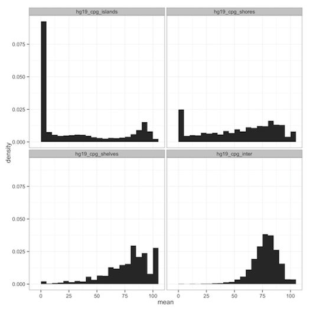
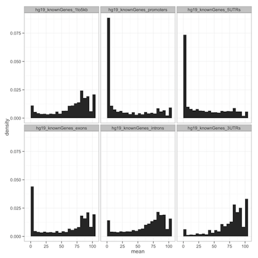
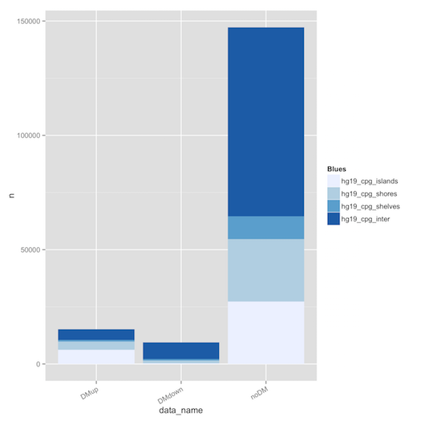
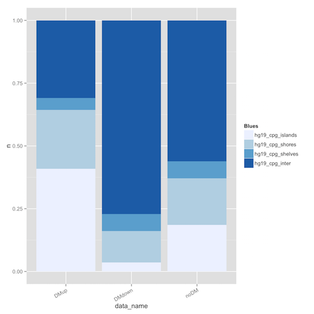

## Motivation

- Many high-throughput genomic experiments give genomic regions as results.
    - ChIP-seq gives regions representing transcription factor (TF) binding.
    - Genome-wide association studies (GWAS) give single nucleotide polymorphisms (SNPs) associated with phenotypes.
    - Bisulfite sequencing (BS-seq) gives percent methylation of CpGs.
    - hMeDIP-seq gives qualitative regions of methylation.

## Natural Questions About Genomic Regions

- **What genomic features do these sites or regions intersect?**
    - Is that SNP in an exon?
    - Does that TF primarily bind at promoters?
    - Is methylation lower in CpG dense regions?
    - Is there more differential methylation in exons or introns?

# Implementation of `annotatr`

## `annotatr`

- An R package that gives genomic context to regions of interest.
    - We developed the package in five modules.
        - Annotation
        - Read
        - Intersect
        - Summarize
        - Visualize

## Annotation

- `bedtools`, `awk`, and `R` to make annotations for hg19, hg38, mm9, and mm10.
    - UCSC CpG annotations (islands, shelves, shores, inter).
    - UCSC knownGenes annotations (basic and detailed).


## Read and Intersect

- Reading (`read_bed()`)
    - We found `readr::read_tsv()` is much faster than `base::read.table()`.
    - Users give `BED6` files representing regions transformed into `GenomicRanges`.
- Intersecting (`intersect_annotations()` and `annotate_intersections()`)
    - User-selected annotations are retrieved from `data/` and `GenomicRanges::findOverlaps()` returns all intersections.
    - Collate intersections with original data to return table for output.
    - Big speedups with `dplyr::bind_rows()` + `dplyr::arrange()` over `base::Reduce()` + `base::order()`.

## Summarize and Visualize

- Summarize collated intersections with `dplyr::summarize()` and `dplyr::group_by()`.
    - Much faster than `base::split()` + `lapply()`.
- Visualize the results with `ggplot2`.
    - Can examine a data column across annotations.
    - Can examine a categorical column across annotations.

# Two Case Studies

## C1: CpG Methylation Rates in HNSCC Samples

- Head and Neck Squamous Cell Carcinoma (HNSCC) and Human Papilloma Virus (HPV) integration investigation at the UM Hospital.
- What is the methylation environment like in different genomic contexts?
- Still processing samples, but here's what `annotatr` can do with one.

## C1: Patient Methylation Over CpG Annots.

<div class="centered">
  
</div>

## C1: Patient Methylation Over Basic Gene Annots.

<div class="centered">
  
</div>

## C2: Differential Methylation in Mutant vs Normal

- We looked at the location of regions of differential methylation in CpG annotations.
- The IDH2 mutant prevents methylated CpGs from undergoing the de-methylation pathway. It's methylation was compared to NBM, the normal bone marrow.
    - DM up means hyper-methylated in IDH2mut.
    - DM down means hypo-methylated in IDH2mut.

## C2: Visualizing Classifiers Across Annotations

<div class="columns-2">
  

  
</div>

# Performance

## Benchmarking with `microbenchmark`

- `ChIPpeakAnno` is an R package that does something similar, but does not have the same visualization options, and enforces a rule of one annotation per region.
- Comparison of annotation of "small" file of 164K regions.
```{r, echo=FALSE}
  bench = read.table('../analysis/microbench_small_results.txt', header=T, sep='\t', quote='\"')
  bench = split(bench, bench$expr)
  names(bench) = c('ChIPpeakAnno','annotatr')
  final = t(sapply(bench, function(b){summary((b$time)*10^-9)}))
  print(final)
```
- Comparison of annotation of "medium" file of 4M regions.
```{r, echo=FALSE}
  bench = read.table('../analysis/microbench_medium_results.txt', header=T, sep='\t', quote='\"')
  bench = split(bench, bench$expr)
  names(bench) = c('ChIPpeakAnno','annotatr')
  final = t(sapply(bench, function(b){summary((b$time)*10^-9)}))
  print(final)
```
- This is a 3.7x - 6.9x speedup!

## Benchmarking with a stopwatch

- Did one comparison of annotation of "large" file with 25M regions.
    - `ChIPpeakAnno` took ~35 minutes.
    - `annotatr` took ~3 minutes.
    - `bedtools` took ~2 minutes.
- Wow, that rules!

## Summary

- We implemented `annotatr`, an R package that intersects genomic regions with genomic annotations.
    - Reports **all** intersections instead of enforcing a prioritization.
    - Visualizes continuous scores or discrete classifications over annotations.
    - **Fast**.
    - Gives summary tables and visualizations that give context to data, and help develop / answer new questions.
- Package source at [http://www.github.com/rcavalcante/annotatr](http://www.github.com/rcavalcante/annotatr).
    - Install with `devtools::install_github('rcavalcante/annotatr')`.

## Future Development

- Tweak some of the figures to clean up labels, etc.
- Add more annotations (e.g. enhancers, first intron, first exon).
- Allow users to provide their own annotations.

## Questions?
