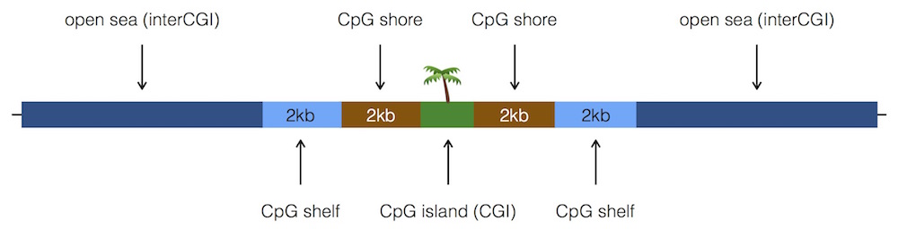
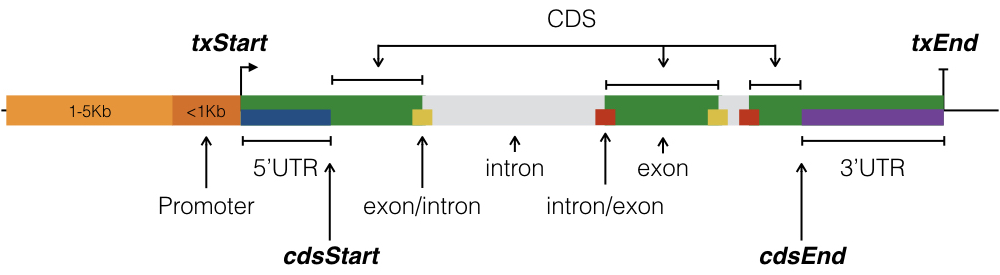

# Introduction

Genomic regions resulting from next-generation sequencing experiments and bioinformatics pipelines are more meaningful when annotated to genomic features. A SNP occurring in an exon, or an enhancer, is likely of greater interest than one occurring in an inter-genic region. It may be of interest to find that a particular transcription factor overwhelmingly binds in promoters, while another binds mostly in 3’UTRs. Hyper-methylation at promoters containing a CpG island may indicate different regulatory regimes in one condition compared to another.

`annotatr` provides genomic annotations and a set of functions to read, intersect, summarize, and visualize genomic regions in the context of genomic annotations.

# Installation

The release version of `annotatr` is available via [Bioconductor](http://bioconductor.org/packages/annotatr/), and can be installed as follows:

```{r, eval=FALSE}
source("http://bioconductor.org/biocLite.R")
biocLite("annotatr")
```

The development version of `annotatr` can be obtained via the [GitHub repository](https://github.com/rcavalcante/annotatr) or [Bioconductor](https://bioconductor.org/packages/devel/bioc/html/annotatr.html). It is easiest to install development versions with the [`devtools`](https://cran.r-project.org/web/packages/devtools/index.html) package as follows:

```{r, eval=FALSE}
devtools::install_github('rcavalcante/annotatr')
```

Changelogs for development releases will be detailed on [GitHub releases](https://github.com/rcavalcante/annotatr/releases).

# Annotations

We rely on the [`AnnotationHub`](https://bioconductor.org/packages/release/bioc/html/AnnotationHub.html) package for CpG annotations, the [`GenomicFeatures`](https://bioconductor.org/packages/release/bioc/html/GenomicFeatures.html), `TxDb.*`, and `org.*.eg.db` packages for genic annotations, and the [`rtracklayer`](http://bioconductor.org/packages/release/bioc/html/rtracklayer.html) package for enhancer annotations from FANTOM5.

Supported annotations are given by `supported_annotations()`. Additionally, custom annotations can be loaded with `read_annotations()`.

## CpG Annotations

The CpG islands are the basis for all CpG annotations, and are given by the `AnnotationHub` package for the given organism. CpG shores are defined as 2Kb upstream/downstream from the ends of the CpG islands, less the CpG islands. CpG shelves are defined as another 2Kb upstream/downstream of the farthest upstream/downstream limits of the CpG shores, less the CpG islands and CpG shores. The remaining genomic regions make up the inter-CGI annotation.



## UCSC knownGenes

The genic annotations are determined by functions from `GenomicFeatures` and data from the `TxDb.*` and `org.*.eg.db` packages. Genic annotations include 1-5Kb upstream of the TSS, the promoter (< 1Kb upstream of the TSS), 5'UTR, first exons, exons, introns, CDS, 3'UTR, and intergenic regions (the intergenic regions exclude the previous list of annotations). The schematic below illustrates the relationship between the different annotations as extracted from the `TxDb.*` packages via `GenomicFeatures` functions.



Also included in genic annotations are intronexon and exonintron boundaries. These annotations are 200bp up/down stream of any boundary between an exon and intron. Important to note, is that the boundaries are with respect to the strand of the gene.

Non-intergenic gene annotations include Entrez ID and gene symbol information where it exists. The `org.*.eg.db` packages for the appropriate organisms are used to provide gene IDs and gene symbols.

The genic annotations have populated `tx_id`, `gene_id`, and `symbol` columns. Respectively they are, the knownGene transcript name, Entrez Gene ID, and gene symbol.

## FANTOM5 Permissive Enhancers

FANTOM5 permissive enhancers were determined from bi-directional CAGE transcription as in [Andersson et al. (2014)](http://www.nature.com/nature/journal/v507/n7493/full/nature12787.html), and are downloaded and processed for **hg19** and **mm9** from the [FANTOM5](http://fantom.gsc.riken.jp/5/datafiles/phase2.0/extra/Enhancers/) resource.

## GENCODE lncRNA transcripts

The long non-coding RNA (lncRNA) annotations are from [GENCODE](https://www.gencodegenes.org) for hg19, hg38, and mm10. The lncRNA transcripts are used, and we eventually plan to include the lncRNA introns/exons at a later date. The lncRNA annotations have populated `tx_id`, `gene_id`, and `symbol` columns. Respectively they are, the Ensembl transcript name, Entrez Gene ID, and gene symbol. As per the `transcript_type` field in the GENCODE anntotations, the [biotypes](https://www.gencodegenes.org/gencode_biotypes.html) are given in the `id` column.

## Custom Annotations

Users may load their own annotations from BED files using the `read_annotations()` function, which uses the `rtracklayer::import()` function. The output is a `GRanges` with `mcols()` for `id`, `tx_id`, `gene_id`, `symbol`, and `type`. If a user wants to include `tx_id`, `gene_id`, and/or `symbol` in their custom annotations they can be included as extra columns on a BED6 input file.

```{r, echo=FALSE}
suppressWarnings(suppressMessages(suppressPackageStartupMessages(library(annotatr))))
```

```{r, warning = FALSE, message = FALSE}
## Use ENCODE ChIP-seq peaks for EZH2 in GM12878 and CJUN in K562
## These files contain chr, start, and end columns
ezh2_file = system.file('extdata', 'Gm12878_Ezh2_peak_annotations.txt.gz', package = 'annotatr')
cjun_file = system.file('extdata', 'K562_Cjun_peak_annotations.txt.gz', package = 'annotatr')

## Custom annotation objects are given names of the form genome_custom_name
read_annotations(con = ezh2_file, genome = 'hg19', name = 'ezh2', format = 'bed')
read_annotations(con = cjun_file, genome = 'hg19', name = 'cjun', format = 'bed')

print(annotatr_cache$get('hg19_custom_ezh2'))
print(annotatr_cache$get('hg19_custom_cjun'))
```

# Usage

The following example is based on the results of testing for differential methylation of genomic regions between two conditions using [methylSig](https://github.com/sartorlab/methylSig). The file (`inst/extdata/IDH2mut_v_NBM_multi_data_chr9.txt.gz`) contains chromosome locations, as well as categorical and numerical data columns, and provides a good example of the flexibility of `annotatr`.

## Reading Genomic Regions

`read_regions()` uses the `rtracklayer::import()` function to read in BED files and convert them to `GRanges` objects. The `name` and `score` columns in a normal BED file can be used for categorical and numeric data, respectively. Additionally, an arbitrary number of categorical and numeric data columns can be appended to a BED6 file. The `extraCols` parameter is used for this purpose, and the `rename_name` and `rename_score` columns allow users to give more descriptive names to these columns.

```{r, warning = FALSE, message = FALSE}
# This file in inst/extdata represents regions tested for differential
# methylation between two conditions. Additionally, there are columns
# reporting the p-value on the test for differential meth., the
# meth. difference between the two groups, and the group meth. rates.
dm_file = system.file('extdata', 'IDH2mut_v_NBM_multi_data_chr9.txt.gz', package = 'annotatr')
extraCols = c(diff_meth = 'numeric', mu0 = 'numeric', mu1 = 'numeric')
dm_regions = read_regions(con = dm_file, genome = 'hg19', extraCols = extraCols, format = 'bed',
    rename_name = 'DM_status', rename_score = 'pval')
print(dm_regions)
```

## Annotating Regions

Users may select annotations a la carte via the accessors listed with `supported_annotations()`, shortcuts, or use custom annotations as described above. The `hg19_cpgs` shortcut annotates regions to CpG islands, CpG shores, CpG shelves, and inter-CGI. The `hg19_basicgenes` shortcut annotates regions to 1-5Kb, promoters, 5'UTRs, exons, introns, and 3'UTRs. Shortcuts for other `supported_genomes()` are accessed in a similar way.

`annotate_regions()` requires a `GRanges` object (either the result of `read_regions()` or an existing object), a `GRanges` object of the `annotations`, and a logical value indicating whether to `ignore.strand` when calling `GenomicRanges::findOverlaps()`. The positive integer `minoverlap` is also passed to `GenomicRanges::findOverlaps()` and specifies the minimum overlap required for a region to be assigned to an annotation.

Before annotating regions, they must be built with `build_annotations()` which requires a character vector of desired annotation codes.

```{r, warning = FALSE, message = FALSE}
# Select annotations for intersection with regions
# Note inclusion of custom annotation, and use of shortcuts
annots = c('hg19_cpgs', 'hg19_basicgenes', 'hg19_genes_intergenic',
    'hg19_enhancers_fantom', 'hg19_genes_firstexons', 'hg19_genes_intronexonboundaries',
    'hg19_lncrna_gencode', 'hg19_custom_ezh2', 'hg19_custom_cjun')

# Build the annotations (a single GRanges object)
annotations = build_annotations(genome = 'hg19', annotations = annots)

# Intersect the regions we read in with the annotations
dm_annotated = annotate_regions(
    regions = dm_regions,
    annotations = annotations,
    ignore.strand = TRUE,
    quiet = FALSE)
# A GRanges object is returned
print(dm_annotated)
```

## Randomizing Regions

Given a set of annotated regions, it is important to know how the annotations compare to those of a randomized set of regions. The `randomize_regions()` function is a wrapper of `regioneR::randomizeRegions()` from the [`regioneR`](http://bioconductor.org/packages/release/bioc/html/regioneR.html) package that creates a set of random regions given a `GRanges` object. After creating the random set, they must be annotated with `annotate_regions()` for later use. Only `supported_genomes()` can be used in our wrapper function. Downstream functions that support using random region annotations are `summarize_annotations()`, `plot_annotation()`, and `plot_categorical()`.

It is important to note that if the regions to be randomized have a particular property, for example they are CpGs, the `randomize_regions()` wrapper will not preserve that property! Instead, we recommend using `regioneR::resampleRegions()` with `universe` being the superset of the data regions you want to sample from.

```{r, warning = FALSE, message = FALSE}
# Randomize the input regions
dm_random_regions = randomize_regions(
    regions = dm_regions,
    allow.overlaps = TRUE,
    per.chromosome = TRUE)

# Annotate the random regions using the same annotations as above
# These will be used in later functions
dm_random_annotated = annotate_regions(
    regions = dm_random_regions,
    annotations = annotations,
    ignore.strand = TRUE,
    quiet = TRUE)
```

## Summarizing Over Annotations

The three summarization functions below take the `GRanges` objects output from `annotate_regions()` as their input, and output either a `dplyr::tbl_df` (for `summarize_annotations()`) or `dplyr::grouped_df` (for the others).

```{r, eval=FALSE}
# Usage of summarize functions with defaults
summarize_annotations(annotated_regions, annotated_random, quiet = FALSE)

summarize_numerical(
    annotated_regions,
    by = c("annot.type", "annot.id"),
    over,
    quiet = FALSE)

summarize_categorical(
    annotated_regions,
    by = c("annot.type", "annot.id"),
    quiet = FALSE)
```

When there is no categorical (`name` column) or numerical (`score` column) information associated with the regions, `summarize_annotations()` is the only possible function to use. It gives the counts of regions in each annotation type (see example below). If there is categorical and/or numerical information, then `summarize_numerical()` and/or `summarize_categorical()` may be used. Using random region annotations is only available for `summarize_annotations()`.

```{r, warning = FALSE, message = FALSE}
# Find the number of regions per annotation type
dm_annsum = summarize_annotations(
    annotated_regions = dm_annotated,
    quiet = TRUE)
print(dm_annsum)

# Find the number of regions per annotation type
# and the number of random regions per annotation type
dm_annsum_rnd = summarize_annotations(
    annotated_regions = dm_annotated,
    annotated_random = dm_random_annotated,
    quiet = TRUE)
print(dm_annsum_rnd)

# Take the mean of the diff_meth column across all regions
# occurring in an annotation.
dm_numsum = summarize_numerical(
    annotated_regions = dm_annotated,
    by = c('annot.type', 'annot.id'),
    over = c('diff_meth'),
    quiet = TRUE)
print(dm_numsum)

# Count the occurrences of classifications in the DM_status
# column across the annotation types.
dm_catsum = summarize_categorical(
    annotated_regions = dm_annotated,
    by = c('annot.type', 'DM_status'),
    quiet = TRUE)
print(dm_catsum)
```

## Plotting

The 5 plot functions described below are to be used on the object returned by `annotate_regions()`. The plot functions return an object of type `ggplot` that can be viewed (`print`), saved (`ggsave`), or modified with additional `ggplot2` code.

```{r, eval=FALSE}
# Usage of plot functions with defaults

plot_annotation(annotated_regions, annotated_random, annotation_order = NULL,
  plot_title, x_label, y_label, quiet = FALSE)

plot_coannotations(annotated_regions, annotation_order = NULL, plot_title,
  axes_label, quiet = FALSE)

plot_numerical(annotated_regions, x, y, facet = "annot.type",
  facet_order = NULL, bin_width = 10, plot_title, x_label, y_label,
  quiet = FALSE)

plot_numerical_coannotations(annotated_regions, x, y, annot1, annot2,
  bin_width = 10, plot_title, x_label, y_label, quiet = FALSE)

plot_categorical(annotated_regions, annotated_random, x, fill = NULL,
  x_order = NULL, fill_order = NULL, position = "stack", plot_title,
  legend_title, x_label, y_label, quiet = FALSE)
```

### Plotting Regions per Annotation

```{r, fig.align='center', fig.cap='Number of DM regions per annotation.', fig.height=6, fig.width=6, fig.show = 'hold', warning = FALSE, message = FALSE}
# View the number of regions per annotation. This function
# is useful when there is no classification or data
# associated with the regions.
annots_order = c(
    'hg19_custom_ezh2',
    'hg19_custom_cjun',
    'hg19_enhancers_fantom',
    'hg19_genes_1to5kb',
    'hg19_genes_promoters',
    'hg19_genes_5UTRs',
    'hg19_genes_firstexons',
    'hg19_genes_exons',
    'hg19_genes_intronexonboundaries',
    'hg19_genes_introns',
    'hg19_genes_3UTRs',
    'hg19_genes_intergenic')
dm_vs_kg_annotations = plot_annotation(
    annotated_regions = dm_annotated,
    annotation_order = annots_order,
    plot_title = '# of Sites Tested for DM annotated on chr9',
    x_label = 'knownGene Annotations',
    y_label = 'Count')
print(dm_vs_kg_annotations)
```

The `plot_annotation()` can also use the annotated random regions in the `annotated_random` argument to plot the number of random regions per annotation type next to the number of input data regions.

```{r, fig.align='center', fig.cap='Number of DM regions per annotation with randomized regions.', fig.height=6, fig.width=6, fig.show = 'hold', warning = FALSE, message = FALSE}
# View the number of regions per annotation and include the annotation
# of randomized regions
annots_order = c(
    'hg19_custom_ezh2',
    'hg19_custom_cjun',
    'hg19_enhancers_fantom',
    'hg19_genes_1to5kb',
    'hg19_genes_promoters',
    'hg19_genes_5UTRs',
    'hg19_genes_firstexons',
    'hg19_genes_exons',
    'hg19_genes_intronexonboundaries',
    'hg19_genes_introns',
    'hg19_genes_3UTRs',
    'hg19_genes_intergenic',
    'hg19_lncrna_gencode')
dm_vs_kg_annotations_wrandom = plot_annotation(
    annotated_regions = dm_annotated,
    annotated_random = dm_random_annotated,
    annotation_order = annots_order,
    plot_title = 'Dist. of Sites Tested for DM (with rndm.)',
    x_label = 'Annotations',
    y_label = 'Count')
print(dm_vs_kg_annotations_wrandom)
```

### Plotting Regions Occurring in Pairs of Annotations

```{r, fig.align='center', fig.cap='Number of DM regions per pair of annotations.', fig.height=8, fig.width=8, fig.show = 'hold', warning = FALSE, message = FALSE}
# View a heatmap of regions occurring in pairs of annotations
annots_order = c(
    'hg19_custom_ezh2',
    'hg19_custom_cjun',
    'hg19_enhancers_fantom',
    'hg19_genes_1to5kb',
    'hg19_genes_promoters',
    'hg19_genes_5UTRs',
    'hg19_genes_firstexons',
    'hg19_genes_exons',
    'hg19_genes_intronexonboundaries',
    'hg19_genes_introns',
    'hg19_genes_3UTRs',
    'hg19_genes_intergenic',
    'hg19_lncrna_gencode')
dm_vs_coannotations = plot_coannotations(
    annotated_regions = dm_annotated,
    annotation_order = annots_order,
    axes_label = 'Annotations',
    plot_title = 'Regions in Pairs of Annotations')
print(dm_vs_coannotations)
```

### Plotting Numerical Data Over Regions

With numerical data, the `plot_numerical()` function plots a single variable (histogram) or two variables (scatterplot) at the region level, faceting over the annotations. Note, when the plot is a histogram, the distribution over all regions is plotted within each facet.

```{r, fig.align='center', fig.cap='Methylation Rates in Group 0 for Regions Over DM Status.', fig.height=6, fig.width=6, fig.show='hold', warning = FALSE, message = FALSE}
dm_vs_regions_annot = plot_numerical(
    annotated_regions = dm_annotated,
    x = 'mu0',
    facet = 'annot.type',
    facet_order = c('hg19_genes_1to5kb','hg19_genes_promoters',
        'hg19_genes_5UTRs','hg19_genes_3UTRs', 'hg19_custom_ezh2',
        'hg19_custom_cjun', 'hg19_genes_intergenic', 'hg19_cpg_islands',
        'hg19_lncrna_gencode'),
    bin_width = 5,
    plot_title = 'Group 0 Region Methylation In Genes',
    x_label = 'Group 0')
print(dm_vs_regions_annot)
```

```{r, fig.align='center', fig.cap='Methylation Rates in Regions Over DM Status in Group 0 vs Group 1.', fig.height=6, fig.width=6, fig.show='hold', warning = FALSE, message = FALSE}
dm_vs_regions_name = plot_numerical(
    annotated_regions = dm_annotated,
    x = 'mu0',
    y = 'mu1',
    facet = 'annot.type',
    facet_order = c('hg19_genes_1to5kb','hg19_genes_promoters',
        'hg19_genes_5UTRs','hg19_genes_3UTRs', 'hg19_custom_ezh2',
        'hg19_custom_cjun', 'hg19_genes_intergenic', 'hg19_cpg_islands',
        'hg19_cpg_shores'),
    plot_title = 'Region Methylation: Group 0 vs Group 1',
    x_label = 'Group 0',
    y_label = 'Group 1')
print(dm_vs_regions_name)
```

The `plot_numerical_coannotations()` shows the distribution of numerical data for regions occurring in any two annotations, as well as in one or the other annotation. For example, the following example shows CpG methylation rates for CpGs occurring in just promoters, just CpG islands, and both promoters and CpG islands.

```{r, fig.align='center', fig.cap='Group 0 methylation Rates in Regions in promoters, CpG islands, and both.', fig.height=5, fig.width=12, fig.show='hold', warning = FALSE, message = FALSE}
dm_vs_num_co = plot_numerical_coannotations(
    annotated_regions = dm_annotated,
    x = 'mu0',
    annot1 = 'hg19_cpg_islands',
    annot2 = 'hg19_genes_promoters',
    bin_width = 5,
    plot_title = 'Group 0 Perc. Meth. in CpG Islands and Promoters',
    x_label = 'Percent Methylation')
print(dm_vs_num_co)
```

### Plotting Categorical Data

```{r, fig.align='center', fig.cap='Differential methylation classification with counts of CpG annotations.', fig.height=6, fig.width=6, fig.show='hold', warning = FALSE, message = FALSE}
# View the counts of CpG annotations in data classes

# The orders for the x-axis labels. This is also a subset
# of the labels (hyper, hypo, none).
x_order = c(
    'hyper',
    'hypo')
# The orders for the fill labels. Can also use this
# parameter to subset annotation types to fill.
fill_order = c(
    'hg19_cpg_islands',
    'hg19_cpg_shores',
    'hg19_cpg_shelves',
    'hg19_cpg_inter')
# Make a barplot of the data class where each bar
# is composed of the counts of CpG annotations.
dm_vs_cpg_cat1 = plot_categorical(
    annotated_regions = dm_annotated, x='DM_status', fill='annot.type',
    x_order = x_order, fill_order = fill_order, position='stack',
    plot_title = 'DM Status by CpG Annotation Counts',
    legend_title = 'Annotations',
    x_label = 'DM status',
    y_label = 'Count')
print(dm_vs_cpg_cat1)
```

```{r, fig.align='center', fig.cap='Differential methylation classification with proportion of CpG annotations.', fig.height=6, fig.width=6, fig.show='hold', warning = FALSE, message = FALSE}
# Use the same order vectors as the previous code block,
# but use proportional fill instead of counts.

# Make a barplot of the data class where each bar
# is composed of the *proportion* of CpG annotations.
dm_vs_cpg_cat2 = plot_categorical(
    annotated_regions = dm_annotated, x='DM_status', fill='annot.type',
    x_order = x_order, fill_order = fill_order, position='fill',
    plot_title = 'DM Status by CpG Annotation Proportions',
    legend_title = 'Annotations',
    x_label = 'DM status',
    y_label = 'Proportion')
print(dm_vs_cpg_cat2)
```

As with `plot_annotation()` one may add annotations for random regions to the `annotated_random` parameter of `plot_categorical()`. The result is a Random Regions bar representing the distribution of random regions for the categorical variable used for `fill`. NOTE: Random regions can only be added when `fill = 'annot.type'`.

```{r, fig.align='center', fig.cap='Differential methylation classification with proportion of CpG annotations and random regions.', fig.height=6, fig.width=6, fig.show='hold', warning = FALSE, message = FALSE}
# Add in the randomized annotations for "Random Regions" bar

# Make a barplot of the data class where each bar
# is composed of the *proportion* of CpG annotations, and
# includes "All" regions tested for DM and "Random Regions"
# regions consisting of randomized regions.
dm_vs_cpg_cat_random = plot_categorical(
    annotated_regions = dm_annotated, annotated_random = dm_random_annotated,
    x='DM_status', fill='annot.type',
    x_order = x_order, fill_order = fill_order, position='fill',
    plot_title = 'DM Status by CpG Annotation Proportions',
    legend_title = 'Annotations',
    x_label = 'DM status',
    y_label = 'Proportion')
print(dm_vs_cpg_cat_random)
```

```{r, fig.align='center', fig.cap='Basic gene annotations with proportions of DM classification.', fig.height=6, fig.width=6, fig.show='hold', warning = FALSE, message = FALSE}
# View the proportions of data classes in knownGene annotations

# The orders for the x-axis labels.
x_order = c(
    'hg19_custom_ezh2',
    'hg19_custom_cjun',
    'hg19_enhancers_fantom',
    'hg19_genes_1to5kb',
    'hg19_genes_promoters',
    'hg19_genes_5UTRs',
    'hg19_genes_exons',
    'hg19_genes_introns',
    'hg19_genes_3UTRs',
    'hg19_genes_intergenic',
    'hg19_lncrna_gencode')
# The orders for the fill labels.
fill_order = c(
    'hyper',
    'hypo',
    'none')
dm_vs_kg_cat = plot_categorical(
    annotated_regions = dm_annotated, x='annot.type', fill='DM_status',
    x_order = x_order, fill_order = fill_order, position='fill',
    legend_title = 'DM Status',
    x_label = 'knownGene Annotations',
    y_label = 'Proportion')
print(dm_vs_kg_cat)
```
