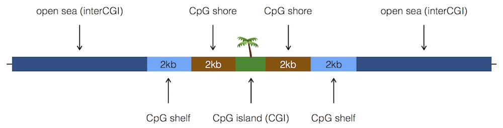
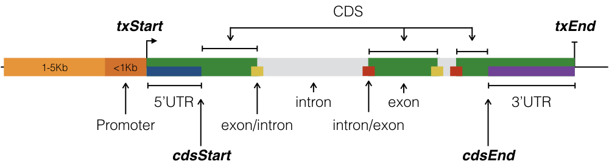

# Introduction

Genomic regions resulting from next-generation sequencing experiments and bioinformatics pipelines are more meaningful when annotated to genomic features. A SNP occurring in an exon, or an enhancer, is likely of greater interest than one occurring in an inter-genic region. It may be of interest to find that a particular transcription factor overwhelmingly binds in promoters, while another binds mostly in 3’UTRs. Hyper-methylation at promoters containing a CpG island may indicate different regulatory regimes in one condition compared to another.

`annotatr` provides genomic annotations and a set of functions to read, intersect, summarize, and visualize genomic regions in the context of genomic annotations.

# Installation

The release version of `annotatr` is available via [Bioconductor](http://bioconductor.org/packages/annotatr/), and can be installed as follows:

```{r, eval=FALSE}
if (!requireNamespace("BiocManager", quietly=TRUE))
    install.packages("BiocManager")
BiocManager::install("annotatr")
```

The development version of `annotatr` can be obtained via the [GitHub repository](https://github.com/rcavalcante/annotatr) or [Bioconductor](https://bioconductor.org/packages/devel/bioc/html/annotatr.html). It is easiest to install development versions with the [`devtools`](https://cran.r-project.org/web/packages/devtools/index.html) package as follows:

```{r, eval=FALSE}
devtools::install_github('rcavalcante/annotatr')
```

Changelogs for development releases will be detailed on [GitHub releases](https://github.com/rcavalcante/annotatr/releases).

# Annotations

There are three types of annotations available to annotatr:

1. Built-in annotations including CpG annotations, genic annotations, enhancers, GENCODE lncRNAs, and chromatin states from chromHMM. Base data for each of these annotations is retrieved and processed in some way. See each below for details on data source and processing.
2. AnnotationHub annotations include any GRanges resource within the Bioconductor AnnotationHub web resource.
3. Custom annotations provided by the user.

## CpG Annotations

The CpG islands are the basis for all CpG annotations, and are given by the `AnnotationHub` package for the given organism. CpG shores are defined as 2Kb upstream/downstream from the ends of the CpG islands, less the CpG islands. CpG shelves are defined as another 2Kb upstream/downstream of the farthest upstream/downstream limits of the CpG shores, less the CpG islands and CpG shores. The remaining genomic regions make up the inter-CGI annotation.

CpG annotations are available for hg19, hg38, mm9, mm10, rn4, rn5, rn6.



## Genic Annotations

The genic annotations are determined by functions from `GenomicFeatures` and data from the `TxDb.*` and `org.*.eg.db` packages. Genic annotations include 1-5Kb upstream of the TSS, the promoter (< 1Kb upstream of the TSS), 5'UTR, first exons, exons, introns, CDS, 3'UTR, and intergenic regions (the intergenic regions exclude the previous list of annotations). The schematic below illustrates the relationship between the different annotations as extracted from the `TxDb.*` packages via `GenomicFeatures` functions.



Also included in genic annotations are intronexon and exonintron boundaries. These annotations are 200bp up/down stream of any boundary between an exon and intron. Important to note, is that the boundaries are with respect to the strand of the gene.

Non-intergenic gene annotations include Entrez ID and gene symbol information where it exists. The `org.*.eg.db` packages for the appropriate organisms are used to provide gene IDs and gene symbols. For sheep (`oviariramb2`), which has no `TxDb.*` or `org.*.eg.db` packages, gene annotations are built from the Ensembl `EnsDb` in `AnnotationHub` and include Ensembl gene IDs and gene symbols. Its CpG islands come from the UCSC GenArk assembly hub.

The genic annotations have populated `tx_id`, `gene_id`, and `symbol` columns. Respectively they are, the knownGene transcript name, Entrez Gene ID, and gene symbol.

Genic annotations are available for all hg19, hg38, mm9, mm10, rn4, rn5, rn6, dm3, and dm6.

## MANE Select Transcripts

The genic annotations above include every transcript of a gene, so a region in an exon of one isoform may be in an intron of another. To annotate regions to one main isoform per gene, use the MANE Select transcripts for hg38 ([Morales et al., 2022](https://doi.org/10.1038/s41586-022-04558-8)). MANE (Matched Annotation from NCBI and EMBL-EBI) chooses one representative transcript for each human protein-coding gene, which is identical in RefSeq and Ensembl/GENCODE.

The MANE annotations have the same types as the genic annotations, except intergenic: MANE only covers protein-coding genes, so the regions outside MANE transcripts would include non-coding genes. The codes are of the form `hg38_mane_promoters`, and the `hg38_basicmane` shortcut builds the same types as `hg38_basicgenes`. The `tx_id` column is the Ensembl transcript ID, and `gene_id` is the Entrez Gene ID, as for `hg38_genes_*`. The annotations are built from the MANE GTF from NCBI, which needs the `txdbmaker` package, and are cached like the others. MANE Plus Clinical transcripts, which some clinical genes have in addition to MANE Select, are not included.

```{r, eval = FALSE}
# One transcript per gene
mane_annotations = build_annotations(genome = 'hg38', annotations = 'hg38_basicmane')

# Or alongside all transcripts, e.g. to compare them
annotations = build_annotations(genome = 'hg38',
    annotations = c('hg38_genes_promoters', 'hg38_mane_promoters'))
```

## FANTOM5 Permissive Enhancers

FANTOM5 permissive enhancers were determined from bi-directional CAGE transcription as in [Andersson et al. (2014)](http://www.nature.com/nature/journal/v507/n7493/full/nature12787.html), and are downloaded and processed for hg19 and mm9 from the [FANTOM5](http://fantom.gsc.riken.jp/5/datafiles/phase2.0/extra/Enhancers/) resource. Using the `rtracklayer::liftOver()` function, enhancers from hg19 are lifted to hg38, and mm9 to mm10.

## GENCODE lncRNA transcripts

The long non-coding RNA (lncRNA) annotations are from [GENCODE](https://www.gencodegenes.org) for hg19, hg38, and mm10. The lncRNA transcripts are used, and we eventually plan to include the lncRNA introns/exons at a later date. The lncRNA annotations have populated `tx_id`, `gene_id`, and `symbol` columns. Respectively they are, the Ensembl transcript name, Entrez Gene ID, and gene symbol. As per the `transcript_type` field in the GENCODE anntotations, the [biotypes](https://www.gencodegenes.org/gencode_biotypes.html) are given in the `id` column.

## Chromatin states from ChromHMM

Chromatin states determined by chromHMM ([Ernst and Kellis (2012)](http://www.nature.com/nmeth/journal/v9/n3/full/nmeth.1906.html)) in hg19 are available for nine cell lines (Gm12878, H1hesc, Hepg2, Hmec, Hsmm, Huvec, K562, Nhek, and Nhlf) via the UCSC Genome Browser tracks. Annotations for all states can be built using a shortcut like `hg19_Gm12878-chromatin`, or specific chromatin states can be accessed via codes like `hg19_chromatin_Gm12878-StrongEnhancer` or `hg19_chromatin_Gm12878-Repressed`.

## `AnnotationHub` Annotations

The `AnnotationHub` Bioconductor package is a client for the AnnotationHub web resource. From the package description:

> The AnnotationHub web resource provides a central location where genomic files (e.g., VCF, bed, wig) and other resources from standard locations (e.g., UCSC, Ensembl) can be discovered. The resource includes metadata about each resource, e.g., a textual description, tags, and date of modification. The client creates and manages a local cache of files retrieved by the user, helping with quick and reproducible access.

Using the `build_ah_annots()` function, users can turn any resource of class `GRanges` into an annotation for use in `annotatr`. As an example, we create annotations for H3K4me3 ChIP-seq peaks in Gm12878 and H1-hesc cells.

```{r, echo=FALSE}
suppressWarnings(suppressMessages(suppressPackageStartupMessages(library(annotatr))))
```

```{r, warning = FALSE, message = FALSE}
# Create a named vector for the AnnotationHub accession codes with desired names
h3k4me3_codes = c('Gm12878' = 'AH23256')
# Fetch ah_codes from AnnotationHub and create annotations annotatr understands
build_ah_annots(genome = 'hg19', ah_codes = h3k4me3_codes, annotation_class = 'H3K4me3')
# The annotations as they appear in annotatr_cache
ah_names = c('hg19_H3K4me3_Gm12878')

print(annotatr_cache$get('hg19_H3K4me3_Gm12878'))
```

## Custom Annotations

Users may load their own annotations from BED files using the `read_annotations()` function, which uses the `rtracklayer::import()` function. The output is a `GRanges` with `mcols()` for `id`, `tx_id`, `gene_id`, `symbol`, and `type`. If a user wants to include `tx_id`, `gene_id`, and/or `symbol` in their custom annotations they can be included as extra columns on a BED6 input file.

```{r, warning = FALSE, message = FALSE}
## Use ENCODE ChIP-seq peaks for EZH2 in GM12878
## These files contain chr, start, and end columns
ezh2_file = system.file('extdata', 'Gm12878_Ezh2_peak_annotations.txt.gz', package = 'annotatr')

## read_annotations() returns the custom annotations
ezh2_annotations = read_annotations(con = ezh2_file, genome = 'hg19', name = 'ezh2', format = 'bed')

print(ezh2_annotations)
```

Custom annotations can be combined with other annotations using `c()`, e.g. `c(ezh2_annotations, build_annotations(genome = 'hg19', annotations = 'hg19_cpgs'))`. `read_annotations()` also stores them in the `annotatr_cache` environment for the current R session, with names of the form `genome_custom_name`, so they can be included by name in `build_annotations()`, as in the example below. To see what is in the `annotatr_cache` environment, do the following:

```{r, warning = FALSE, message = FALSE}
print(annotatr_cache$list_env())
```

## Caching Built Annotations

Building annotations can take a while, especially gene annotations, which are built from the `TxDb.*` packages or an `EnsDb`. So `build_annotations()` saves each annotation it builds, and each file it downloads, in a cache on disk, and later calls load them from the cache in seconds. The cache persists between R sessions. A cached annotation is rebuilt automatically after annotatr is updated, and for gene annotations, after the `TxDb.*` or `org.*.eg.db` package is updated.

```{r, eval = FALSE}
# See what is cached, with sizes and the versions each annotation was built with
list_cached_annotations()

# Build without reading or writing the cache
annotations = build_annotations(genome = 'hg19', annotations = 'hg19_cpgs', cache = FALSE)

# Remove the cached hg19 annotations and downloads, so they are built again
clear_cached_annotations(genome = 'hg19')

# Keep the cache somewhere else, e.g. on a cluster with a small home directory
options(annotatr.cache = '/path/with/space')
```

If annotations seem out of date or a cached file causes errors, see the troubleshooting section of `?"cached-annotations"`. This cache is separate from `annotatr_cache`, which holds custom annotations for the current R session only.

# Usage

The following example is based on the results of testing for differential methylation of genomic regions between two conditions using [methylSig](https://github.com/sartorlab/methylSig). The file (`inst/extdata/IDH2mut_v_NBM_multi_data_chr9.txt.gz`) contains chromosome locations, as well as categorical and numerical data columns, and provides a good example of the flexibility of `annotatr`.

## Reading Genomic Regions

`read_regions()` uses the `rtracklayer::import()` function to read in BED files and convert them to `GRanges` objects. The `name` and `score` columns in a normal BED file can be used for categorical and numeric data, respectively. Additionally, an arbitrary number of categorical and numeric data columns can be appended to a BED6 file. The `extraCols` parameter is used for this purpose, and the `rename_name` and `rename_score` columns allow users to give more descriptive names to these columns.

```{r, warning = FALSE, message = FALSE}
# This file in inst/extdata represents regions tested for differential
# methylation between two conditions. Additionally, there are columns
# reporting the p-value on the test for differential meth., the
# meth. difference between the two groups, and the group meth. rates.
dm_file = system.file('extdata', 'IDH2mut_v_NBM_multi_data_chr9.txt.gz', package = 'annotatr')
extraCols = c(diff_meth = 'numeric', mu0 = 'numeric', mu1 = 'numeric')
dm_regions = read_regions(con = dm_file, genome = 'hg19', extraCols = extraCols, format = 'bed',
    rename_name = 'DM_status', rename_score = 'pval')
# Use less regions to speed things up
dm_regions = dm_regions[1:2000]
print(dm_regions)
```

## Genome Information

Every `GRanges` has a `Seqinfo` describing its genome: the chromosome names, their lengths, whether they are circular, and the genome (e.g. `hg19`). Setting `genome` in `read_regions()` fills this in, and annotations from `build_annotations()` have it for their genome.

When regions are annotated, `annotate_regions()` checks the regions and annotations match:

* If they are from different genomes, e.g. regions from `hg38` and annotations from `hg19`, it gives an error, rather than annotating regions to the wrong places.
* If they have no chromosome names in common, e.g. `2` in the regions and `chr2` in the annotations, it gives an error. Annotations from `build_annotations()` use UCSC-style names (`chr1`, `chr2`, etc.), and `GenomeInfoDb::seqlevelsStyle(regions) = 'UCSC'` changes the regions to match.
* If the regions have no genome, it can't check the genomes match, so it suggests setting `genome` in `read_regions()`.

The `Seqinfo` of regions or annotations can be seen with `Seqinfo::seqinfo()`, and the genome with `Seqinfo::genome()`.

```{r, warning = FALSE, message = FALSE}
# The genome of the regions read in above
print(unique(Seqinfo::genome(dm_regions)))
```

## Annotating Regions

Users may select annotations a la carte via the accessors listed with `builtin_annotations()`, shortcuts, or use custom annotations as described above. The `hg19_cpgs` shortcut annotates regions to CpG islands, CpG shores, CpG shelves, and inter-CGI. The `hg19_basicgenes` shortcut annotates regions to 1-5Kb, promoters, 5'UTRs, exons, introns, and 3'UTRs. Shortcuts for other `builtin_genomes()` are accessed in a similar way.

`annotate_regions()` requires a `GRanges` object (either the result of `read_regions()` or an existing object), a `GRanges` object of the `annotations`, and a logical value indicating whether to `ignore.strand` when calling `GenomicRanges::findOverlaps()`. The positive integer `minoverlap` is also passed to `GenomicRanges::findOverlaps()` and specifies the minimum overlap required for a region to be assigned to an annotation.

Before annotating regions, they must be built with `build_annotations()` which requires a character vector of desired annotation codes.

```{r, warning = FALSE, message = FALSE}
# Select annotations for intersection with regions
# Note inclusion of custom annotation, and use of shortcuts
annots = c('hg19_cpgs', 'hg19_basicgenes', 'hg19_genes_intergenic',
    'hg19_genes_intronexonboundaries',
    'hg19_custom_ezh2', 'hg19_H3K4me3_Gm12878')

# Build the annotations (a single GRanges object)
annotations = build_annotations(genome = 'hg19', annotations = annots)

# Intersect the regions we read in with the annotations
dm_annotated = annotate_regions(
    regions = dm_regions,
    annotations = annotations,
    ignore.strand = TRUE,
    quiet = FALSE)
# A GRanges object is returned
print(dm_annotated)
```

The `annotate_regions()` function returns a `GRanges`, but it may be more convenient to manipulate a coerced `data.frame`. For example,

```{r, warning = FALSE, message = FALSE}
# Coerce to a data.frame
df_dm_annotated = data.frame(dm_annotated)

# See the GRanges column of dm_annotaed expanded
print(head(df_dm_annotated))

# Subset based on a gene symbol, in this case NOTCH1
notch1_subset = subset(df_dm_annotated, annot.symbol == 'NOTCH1')
print(head(notch1_subset))
```

## Comparing to a Background

Knowing how many regions fall in each annotation is more useful when compared to what would be expected. The right comparison is a *background*: the set of regions your data could have come from. For differentially methylated (DM) regions, that is all regions tested for differential methylation. For differentially bound ChIP-seq peaks, it might be a consensus set of all peaks. The background carries the same biases as the data (e.g. mappability, or the CpGs an assay measures), so differences between the two reflect the biology of interest rather than those biases.

Here the regions read in above are all regions tested for DM, and the `DM_status` column says which are DM. So the data are the DM regions, and the background is all tested regions, which are already annotated. Downstream functions that support a background are `summarize_annotations()`, `plot_annotation()`, and `plot_categorical()`, via their `annotated_random` argument.

```{r, warning = FALSE, message = FALSE}
# The data are the DM regions, and the background is all tested regions
dm_sig_annotated = dm_annotated[dm_annotated$DM_status != 'none']
```

NOTE: `randomize_regions()` is deprecated. Placing regions uniformly at random across the genome ignores those biases, so nearly any data look "enriched" in genic and CpG annotations compared to random regions. When there is no natural background, the permutation test `regioneR::permTest()` in the [`regioneR`](https://bioconductor.org/packages/regioneR) package, with an appropriate mask, gives a null distribution and a p-value. If the data are drawn from a fixed set of candidate regions, `regioneR::resampleRegions()` samples from that set.

## Summarizing Over Annotations

When there is no categorical or numerical information associated with the regions, `summarize_annotations()` is the only possible summarization function to use. It gives the counts of regions in each annotation type (see example below). If there is categorical and/or numerical information, then `summarize_numerical()` and/or `summarize_categorical()` may be used. Using a background is only available for `summarize_annotations()`.

```{r, warning = FALSE, message = FALSE}
# Find the number of regions per annotation type
dm_annsum = summarize_annotations(
    annotated_regions = dm_annotated,
    quiet = TRUE)
print(dm_annsum)

# Find the number of DM regions per annotation type
# and the number of background regions per annotation type
dm_annsum_bg = summarize_annotations(
    annotated_regions = dm_sig_annotated,
    annotated_random = dm_annotated,
    quiet = TRUE)
print(dm_annsum_bg)

# Take the mean of the diff_meth column across all regions
# occurring in an annotation.
dm_numsum = summarize_numerical(
    annotated_regions = dm_annotated,
    by = c('annot.type', 'annot.id'),
    over = c('diff_meth'),
    quiet = TRUE)
print(dm_numsum)

# Count the occurrences of classifications in the DM_status
# column across the annotation types.
dm_catsum = summarize_categorical(
    annotated_regions = dm_annotated,
    by = c('annot.type', 'DM_status'),
    quiet = TRUE)
print(dm_catsum)
```

`summarize_genes()` gives one row per gene, from the gene annotations with a gene ID (e.g. promoters, 1-5Kb, UTRs, exons, and introns). A region counts once toward each gene it is annotated to, and once toward each of the gene's annotation types. The `over` columns are summarized with their mean, median, and standard deviation, and the categories of the `by` column are counted. Use `format = 'long'` for one row per gene and annotation type instead.

```{r, warning = FALSE, message = FALSE}
# One row per gene, with the number of regions in each gene annotation
# type, the number of regions in each DM classification, and the mean,
# median, and standard deviation of the methylation difference
dm_genesum = summarize_genes(
    annotated_regions = dm_annotated,
    over = 'diff_meth',
    by = 'DM_status',
    quiet = TRUE)
print(dm_genesum)
```

## Plotting

The 5 plot functions described below are to be used on the object returned by `annotate_regions()`. The plot functions return an object of type `ggplot` that can be viewed (`print`), saved (`ggsave`), or modified with additional `ggplot2` code.

### Plotting Regions per Annotation

```{r, fig.align='center', fig.cap='Number of DM regions per annotation.', fig.height=6, fig.width=6, fig.show = 'hold', warning = FALSE, message = FALSE}
# View the number of regions per annotation. This function
# is useful when there is no classification or data
# associated with the regions.
annots_order = c(
    'hg19_custom_ezh2',
    'hg19_H3K4me3_Gm12878',
    'hg19_genes_1to5kb',
    'hg19_genes_promoters',
    'hg19_genes_5UTRs',
    'hg19_genes_exons',
    'hg19_genes_intronexonboundaries',
    'hg19_genes_introns',
    'hg19_genes_3UTRs',
    'hg19_genes_intergenic')
dm_vs_kg_annotations = plot_annotation(
    annotated_regions = dm_annotated,
    annotation_order = annots_order,
    plot_title = '# of Sites Tested for DM annotated on chr9',
    x_label = 'knownGene Annotations',
    y_label = 'Count')
print(dm_vs_kg_annotations)
```

The `plot_annotation()` can also use an annotated background in the `annotated_random` argument to plot the number of background regions per annotation type next to the number of data regions.

```{r, fig.align='center', fig.cap='Number of DM regions per annotation with the background of all tested regions.', fig.height=6, fig.width=6, fig.show = 'hold', warning = FALSE, message = FALSE}
# View the number of DM regions per annotation and include the
# annotation of the background of all tested regions
annots_order = c(
    'hg19_custom_ezh2',
    'hg19_H3K4me3_Gm12878',
    'hg19_genes_1to5kb',
    'hg19_genes_promoters',
    'hg19_genes_5UTRs',
    'hg19_genes_exons',
    'hg19_genes_intronexonboundaries',
    'hg19_genes_introns',
    'hg19_genes_3UTRs',
    'hg19_genes_intergenic')
dm_vs_kg_annotations_wbg = plot_annotation(
    annotated_regions = dm_sig_annotated,
    annotated_random = dm_annotated,
    annotation_order = annots_order,
    plot_title = 'Dist. of DM Sites (with background)',
    x_label = 'Annotations',
    y_label = 'Count')
print(dm_vs_kg_annotations_wbg)
```

### Plotting Regions Occurring in Pairs of Annotations

```{r, fig.align='center', fig.cap='Number of DM regions per pair of annotations.', fig.height=8, fig.width=8, fig.show = 'hold', warning = FALSE, message = FALSE}
# View a heatmap of regions occurring in pairs of annotations
annots_order = c(
    'hg19_custom_ezh2',
    'hg19_H3K4me3_Gm12878',
    'hg19_genes_promoters',
    'hg19_genes_5UTRs',
    'hg19_genes_exons',
    'hg19_genes_introns',
    'hg19_genes_3UTRs',
    'hg19_genes_intergenic')
dm_vs_coannotations = plot_coannotations(
    annotated_regions = dm_annotated,
    annotation_order = annots_order,
    axes_label = 'Annotations',
    plot_title = 'Regions in Pairs of Annotations')
print(dm_vs_coannotations)
```

### Plotting Numerical Data Over Regions

With numerical data, the `plot_numerical()` function plots a single variable (histogram) or two variables (scatterplot) at the region level, faceting over the categorical variable of choice. It is possible to include two categorical variables to facet over (see below). Note, when the plot is a histogram, the distribution over all regions is plotted within each facet.

```{r, fig.align='center', fig.cap='Methylation Rates in Group 0 for Regions Over DM Status.', fig.height=6, fig.width=6, fig.show='hold', warning = FALSE, message = FALSE}
dm_vs_regions_annot = plot_numerical(
    annotated_regions = dm_annotated,
    x = 'mu0',
    facet = 'annot.type',
    facet_order = c('hg19_genes_1to5kb','hg19_genes_promoters',
        'hg19_genes_5UTRs','hg19_genes_3UTRs', 'hg19_custom_ezh2',
        'hg19_genes_intergenic', 'hg19_cpg_islands'),
    bin_width = 5,
    plot_title = 'Group 0 Region Methylation In Genes',
    x_label = 'Group 0')
print(dm_vs_regions_annot)
```

```{r, fig.align='center', fig.cap='Methylation Differences for Regions Over DM Status and Annotation Type.', fig.height=6, fig.width=6, fig.show='hold', warning = FALSE, message = FALSE}
dm_vs_regions_annot2 = plot_numerical(
    annotated_regions = dm_annotated,
    x = 'diff_meth',
    facet = c('annot.type','DM_status'),
    facet_order = list(c('hg19_genes_promoters','hg19_genes_5UTRs','hg19_cpg_islands'), c('hyper','hypo','none')),
    bin_width = 5,
    plot_title = 'Group 0 Region Methylation In Genes',
    x_label = 'Methylation Difference')
print(dm_vs_regions_annot2)
```

```{r, fig.align='center', fig.cap='Methylation Rates in Regions Over DM Status in Group 0 vs Group 1.', fig.height=6, fig.width=6, fig.show='hold', warning = FALSE, message = FALSE}
dm_vs_regions_name = plot_numerical(
    annotated_regions = dm_annotated,
    x = 'mu0',
    y = 'mu1',
    facet = 'annot.type',
    facet_order = c('hg19_genes_1to5kb','hg19_genes_promoters',
        'hg19_genes_5UTRs','hg19_genes_3UTRs', 'hg19_custom_ezh2',
        'hg19_genes_intergenic', 'hg19_cpg_islands', 'hg19_cpg_shores'),
    plot_title = 'Region Methylation: Group 0 vs Group 1',
    x_label = 'Group 0',
    y_label = 'Group 1')
print(dm_vs_regions_name)
```

The `plot_numerical_coannotations()` shows the distribution of numerical data for regions occurring in any two annotations, as well as in one or the other annotation. For example, the following example shows CpG methylation rates for CpGs occurring in just promoters, just CpG islands, and both promoters and CpG islands.

```{r, fig.align='center', fig.cap='Group 0 methylation Rates in Regions in promoters, CpG islands, and both.', fig.height=5, fig.width=12, fig.show='hold', warning = FALSE, message = FALSE}
dm_vs_num_co = plot_numerical_coannotations(
    annotated_regions = dm_annotated,
    x = 'mu0',
    annot1 = 'hg19_cpg_islands',
    annot2 = 'hg19_genes_promoters',
    bin_width = 5,
    plot_title = 'Group 0 Perc. Meth. in CpG Islands and Promoters',
    x_label = 'Percent Methylation')
print(dm_vs_num_co)
```

### Plotting Categorical Data

```{r, fig.align='center', fig.cap='Differential methylation classification with counts of CpG annotations.', fig.height=6, fig.width=6, fig.show='hold', warning = FALSE, message = FALSE}
# View the counts of CpG annotations in data classes

# The orders for the x-axis labels. This is also a subset
# of the labels (hyper, hypo, none).
x_order = c(
    'hyper',
    'hypo')
# The orders for the fill labels. Can also use this
# parameter to subset annotation types to fill.
fill_order = c(
    'hg19_cpg_islands',
    'hg19_cpg_shores',
    'hg19_cpg_shelves',
    'hg19_cpg_inter')
# Make a barplot of the data class where each bar
# is composed of the counts of CpG annotations.
dm_vs_cpg_cat1 = plot_categorical(
    annotated_regions = dm_annotated, x='DM_status', fill='annot.type',
    x_order = x_order, fill_order = fill_order, position='stack',
    plot_title = 'DM Status by CpG Annotation Counts',
    legend_title = 'Annotations',
    x_label = 'DM status',
    y_label = 'Count')
print(dm_vs_cpg_cat1)
```

```{r, fig.align='center', fig.cap='Differential methylation classification with proportion of CpG annotations.', fig.height=6, fig.width=6, fig.show='hold', warning = FALSE, message = FALSE}
# Use the same order vectors as the previous code block,
# but use proportional fill instead of counts.

# Make a barplot of the data class where each bar
# is composed of the *proportion* of CpG annotations.
dm_vs_cpg_cat2 = plot_categorical(
    annotated_regions = dm_annotated, x='DM_status', fill='annot.type',
    x_order = x_order, fill_order = fill_order, position='fill',
    plot_title = 'DM Status by CpG Annotation Proportions',
    legend_title = 'Annotations',
    x_label = 'DM status',
    y_label = 'Proportion')
print(dm_vs_cpg_cat2)
```

As with `plot_annotation()` one may add an annotated background to the `annotated_random` parameter of `plot_categorical()`. The result is a Background bar representing the distribution of the background regions for the categorical variable used for `fill`. NOTE: A background can only be added when `fill = 'annot.type'`. In the plots above the data include all tested regions, so the All bar already plays this role. Below, the data are only the DM regions, so the All bar is all DM regions and the Background bar is all tested regions.

```{r, fig.align='center', fig.cap='Differential methylation classification with proportion of CpG annotations and the background.', fig.height=6, fig.width=6, fig.show='hold', warning = FALSE, message = FALSE}
# Add in the background of all tested regions for the "Background" bar

# Make a barplot of the DM classes where each bar
# is composed of the *proportion* of CpG annotations, and
# includes "All" DM regions and the "Background" of all
# regions tested for DM.
dm_vs_cpg_cat_bg = plot_categorical(
    annotated_regions = dm_sig_annotated, annotated_random = dm_annotated,
    x='DM_status', fill='annot.type',
    x_order = c('hyper', 'hypo'), fill_order = fill_order, position='fill',
    plot_title = 'DM Status by CpG Annotation Proportions',
    legend_title = 'Annotations',
    x_label = 'DM status',
    y_label = 'Proportion')
print(dm_vs_cpg_cat_bg)
```

```{r, fig.align='center', fig.cap='Basic gene annotations with proportions of DM classification.', fig.height=6, fig.width=6, fig.show='hold', warning = FALSE, message = FALSE}
# View the proportions of data classes in knownGene annotations

# The orders for the x-axis labels.
x_order = c(
    'hg19_custom_ezh2',
    'hg19_genes_1to5kb',
    'hg19_genes_promoters',
    'hg19_genes_5UTRs',
    'hg19_genes_exons',
    'hg19_genes_introns',
    'hg19_genes_3UTRs',
    'hg19_genes_intergenic')
# The orders for the fill labels.
fill_order = c(
    'hyper',
    'hypo',
    'none')
dm_vs_kg_cat = plot_categorical(
    annotated_regions = dm_annotated, x='annot.type', fill='DM_status',
    x_order = x_order, fill_order = fill_order, position='fill',
    legend_title = 'DM Status',
    x_label = 'knownGene Annotations',
    y_label = 'Proportion')
print(dm_vs_kg_cat)
```
